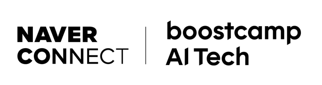

<div align='center'>

  # 🏆 LV.2 NLP 프로젝트 : Generation For NLP

</div>
이 프로젝트는 **“한국 수능 시험에서 우수한 성적을 낼 수 있는 소규모 AI 모델”**을 만들기 위해 시작되었습니다.
GPT, Claude, Gemini 등 대규모 언어 모델이 이미 다양한 시험에서 좋은 성적을 거두고 있지만, 제한된 자원으로도 뛰어난 성능을 낼 수 있는 소규모 모델에 대한 연구 및 오픈소스 생태계가 필요하다고 판단했습니다.
<br><br>

본 프로젝트에서는 Multiple-Choice QA 태스크에 대한 솔루션을 제공합니다. 


## Requirements
- GPU : Tesla V100 GPU Server 32GB
- Python: 3.10.x
- CUDA: 12.1
- PyTorch: 2.5.1+cu121
## How To Use


### Installation


1. git clone
```sh
git clone https://github.com/boostcampaitech7/level2-nlp-generationfornlp-nlp-06-lv3.git
cd level2-nlp-generationfornlp-nlp-06-lv3
```
2. install libraries
```sh
pip install -r requirements.txt
```


### Usage

#### 1. Prepare Data

기본적으로 호환되는 데이터 양식은 다음과 같습니다.  
| id | paragraph  | question       | choices         | answer | question_plus |
|----|-----------|----------------|-----------------|--------|---------------|
| 1  | 예시 지문1 | 예시 질문1     | A, B, C, D      | A      | 추가 지문1    |
| 2  | 예시 지문2 | 예시 질문2     | A, B, C, D      | C      | 추가 지문2    |
| 3  | 예시 지문3 | 예시 질문3     | A, B, C, D, E   | D      | 추가 지문3    |

로 이루어진 데이터입니다.   
<br>

각 컬럼은 다음을 의미 합니다.   

* id(str) - 데이터 고유의 id를 나타냅니다.   
* paragraph(str) - 문제의 지문을 나타냅니다.   
* question(str) - 문제의 질문을 나타냅니다.  
* choices(list) - 선택지를 나타냅니다.  
* answer(str) - 선택지 중의 정답 하나를 나타냅니다.  
* question_plus(str) - 추가 지문을 나타냅니다.  

위 형식의 csv 파일을 아래 예처럼 넣어주면 됩니다.

```kotlin
level2-nlp-generationfornlp-nlp-06-lv3/
├── data/
│   ├── train/
│   │   └── train.csv
│   ├── val/
│   │   └── val.csv
│   └── test/
│       └── test.csv
...
```
#### 2. Training
[huggingface.co](https://huggingface.co) 에서 `API Key`를 발급 받은 후   
[run/run_train_qwen_best.sh](run/run_train_qwen_best.sh) 안의 `HUGGINGFACE_TOKEN`에 넣는 것을 권장합니다.
```sh
run/run_train_qwen_best.sh --nohup
```

* --nohup: nohup 모드 실행 여부

#### 3. Inference 
[huggingface.co](https://huggingface.co) 에서 `API Key`를 발급 받은 후   
[run/run_inference_qwen_best.sh](run/run_inference_qwen_best.sh) 안의 `HUGGINGFACE_TOKEN`에 넣는 것을 권장합니다.

```sh
run/run_inference_qwen_best.sh --nohup
```

* --nohup: nohup 모드 실행 여부

#### 4. Training + Inference 순차 실행 파이프라인
[huggingface.co](https://huggingface.co) 에서 `API Key`를 발급 받은 후   
[run/run_train+inference_qwen_best.sh](run/run_train+inference_qwen_best.sh) 안의 `HUGGINGFACE_TOKEN`에 넣는 것을 권장합니다.
```sh
run/run_train+inference_qwen_best.sh
```

#### 5. 훈련 파라미터 및 데이터 경로 지정 (옵션)

[config/qwen2.5_32B_unsloth_best_config.yaml](config/qwen2.5_32B_unsloth_best_config.yaml) 에에 훈련 파라미터 및 데이터 경로가 지정되어있습니다.  
config에서 지정 해야할 `key-value pair`는 [default_arguments.py](config/default_arguments.py)와 [qwen_arguments.py](config/qwen_arguments.py)를 참조바랍니다.  


```sh
level2-nlp-generationfornlp-nlp-06-lv3
├── config/
│   ├── qwen2.5_32B_unsloth_best_config.yaml
│   ├── default_arguments.py
│   └── qwen_arguments.py
│       
...
```

* --nohup: nohup 모드 실행 여부


## 📁 프로젝트 구조

### 폴더 구조 설명
```sh
project-name/
│
├── data/                     # 데이터셋 폴더
│   
├── notebooks/                # 개인용 작업장(프로젝트 참여자가 하고 싶은 실험)
│
├── src/                      # 소스 코드
│   ├── data/                 # 데이터 로드, 저장 및 처리 코드
│   ├── models/               # 모델 정의 및 구조 코드
│   ├── training/             # 학습 루프, 손실 함수, 최적화 관련 코드
│   ├── evaluation/           # 모델 평가 코드 (메트릭 계산 등)
│   ├── utils/                # 보조 함수나 유틸리티 코드
│   └── visualization/        # 시각화 코드
│
├── experiments/              # 실험 관리 폴더(checkpoint 등)
│   
│
├── scripts/                  # 실행 가능한 스크립트 (주로 파이썬 진입점)
│   ├── train.py              # 학습 스크립트
│   ├── evaluate.py           # 평가 스크립트
│   └── predict.py            # 예측 스크립트
│
├── run                       # 콘솔 실행 자동화 스크립트
|   ├── run.sh          
├── config/                   # 설정 파일 (하이퍼파라미터 및 경로 설정)
│
│
├── requirements.txt          # 필요한 Python 패키지 목록
├── README.md                 # 프로젝트 개요 및 설명
└── .gitignore                # Git에서 제외할 파일 목록
```


## Contributing
프로젝트에 기여하고 싶으시면 jilp1598.git@gmail.com 에 연락을 주세요.  
이슈를 발견하셨으면 [issue tracker](https://github.com/boostcampaitech7/level2-nlp-generationfornlp-nlp-13-lv3/issues/new)에 리포트해주세요.


If you'd like to contribute to this project, please contact us at jilp1598.git@gmail.com.  
If you find any issues, please report them in the [issue tracker](https://github.com/boostcampaitech7/level2-nlp-generationfornlp-nlp-13-lv3/issues/new).

## Contact

기타 질문 및 토론 사항은 Github Discussion에 남겨주시면 됩니다.  

For any other questions or discussion topics, please leave them in the GitHub Discussion.


- **Github Discussion** : [Gihub Discussion](https://github.com/boostcampaitech7/level2-nlp-generationfornlp-nlp-13-lv3/discussions)

## Credit

### 👨‍💻 Contributors

 
| 김현서 [](https://github.com/kimhyeonseo0830) | 이재룡 [](https://github.com/So1pi) | 이정인 [](https://github.com/unsolomon) | 이현풍 [](https://github.com/P-oong) | 임한택 [](https://github.com/LHANTAEK) | 최현우 [](https://github.com/pica-git0) |
|:-:|:-:|:-:|:-:|:-:|:-:|
|  |  |  |  |  |  |


### 👼 role


|팀원   | 역할 |
|------| --- |
| 김현서 | 파인튜닝 라이브러리 탐색, 모델 탐색, 하이퍼파라미터 실험, 어댑터 병합 실험, 외부 데이터셋 전처리 |
| 이재룡 | 모델 탐색, 모델 경량화, 하드웨어 최적화, 메모리 분석 |
| 이정인 | EDA, 데이터 필터링 및 전처리, 데이터 증강 및 주제 분류, 하이퍼파라미터 실험 |
| 이현풍 | EDA, PDF QA pair 생성, 프롬프트 조합, 힌트 생성 LLM 파인튜닝 시도 |
| 임한택 | EDA, 데이터 필터링 및 전처리, 데이터 증강, 모델 탐색 및 실험, LoRA 및 모델 하이퍼파라미터 최적화, 파인튜닝 실험, 앙상블 실험    |
| 최현우 | EDA, 데이터 필터링 및 전처리, 모델 실험 환경 구성, 코드베이스 개선 및 사용성 향상, 실험 수행 및 보고 |


### Mentors and Reviewers

[**monologg (Jangwon Park)**](https://github.com/monologg)  

### Sponsors
<a href="https://boostcamp.connect.or.kr/program_ai.html"></a>