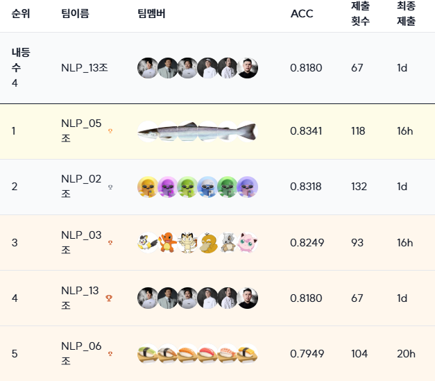
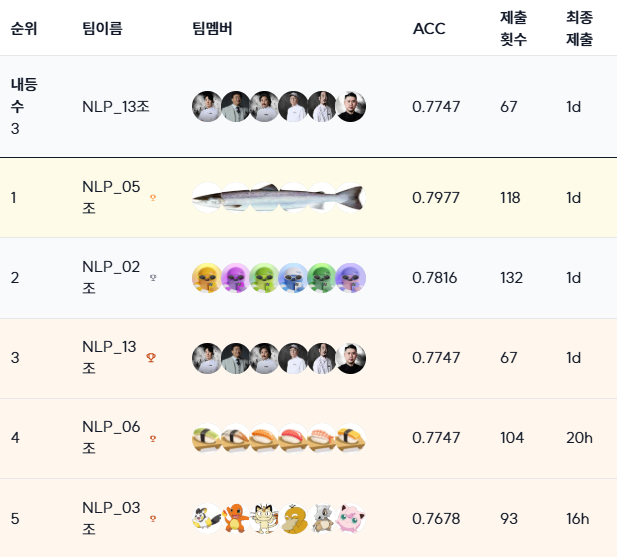
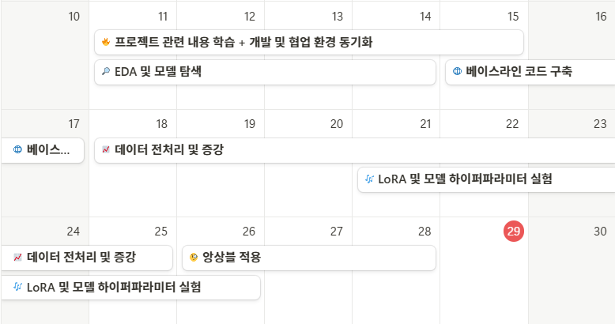

<div align='center'>

  # 🏆 LV.2 NLP 프로젝트 : Generation For NLP

</div>

## ✏️ 대회 소개

| 특징     | 설명 |
|:------:| --- |
| 대회 주제 | '한국어'와 '시험'이라는 주제에 맞춰서 작은 모델들로 수능 시험을 풀어보는 프로젝트 |
| 대회 설명 | 주어진 지문, 질문, 선택지를 기반으로 정확한 정답을 도출하는 모델을 만드는 것을 목표로 합니다. |
| 데이터 구성 | 수능의 국어, 사회 영역(윤리, 정치, 사회)과 비슷한 문제: KMMLU (Korean History), MMMLU (HighSchool 데이터 중 역사, 경제, 정치, 지리, 심리), KLUE MRC (경제, 교육산업, 국제, 부동산, 사회, 생활, 책마을) |
| 평가 지표 | 전체 문제에서 모델이 맞춘 문제 수를 평가하기 위해서 Accuracy를 사용했습니다.|


## 🏅 Leader Board
프로젝트 결과 Public 리더보드 4등, Private 리더보드 3등을 기록하였습니다.
### 🎖️  Public Leader Board (4위)


### 🥉 Private Leader Board (3위)


## 👨‍💻 15조가십오조 멤버
<div align='center'>
 
| 김현서 [](https://github.com/kimhyeonseo0830) | 이재룡 [](https://github.com/So1pi) | 이정인 [](https://github.com/unsolomon) | 이현풍 [](https://github.com/P-oong) | 임한택 [](https://github.com/LHANTAEK) | 최현우 [](https://github.com/pica-git0) |
|:-:|:-:|:-:|:-:|:-:|:-:|
|  |  |  |  |  |  |

</div>

  
## 👼 역할 분담
<div align='center'>

|팀원   | 역할 |
|------| --- |
| 김현서 | 파인튜닝 라이브러리 탐색, 모델 탐색, 하이퍼파라미터 실험, 어댑터 병합 실험, 외부 데이터셋 전처리 |
| 이재룡 | 모델 탐색, 모델 경량화, 하드웨어 최적화, 메모리 분석 |
| 이정인 | EDA, 데이터 필터링 및 전처리, 데이터 증강 및 주제 분류, 하이퍼파라미터 실험 |
| 이현풍 | EDA, PDF QA pair 생성, 프롬프트 조합, 힌트 생성 LLM 파인튜닝 시도 |
| 임한택 | EDA, 데이터 필터링 및 전처리, 데이터 증강, 모델 탐색 및 실험, LoRA 및 모델 하이퍼파라미터 최적화, 파인튜닝 실험, 앙상블 실험    |
| 최현우 | EDA, 데이터 필터링 및 전처리, 모델 실험 환경 구성, 코드베이스 개선 및 사용성 향상, 실험 수행 및 보고 |

</div>


## 🏃 프로젝트 세부사항
### 🎯 프로젝트 목표
- Ko-MMLU 데이터셋을 활용한 수능형 문제 풀이 모델 개발
- 다양한 언어모델 실험 및 성능 비교
- 효율적인 파인튜닝 전략 수립

### 📝 데이터셋
- **학습 데이터**: 2031개
- **평가 데이터**: 869개 (public: 434, private: 435)
- **구성**: 지문, 질문, 선택지(4지선다), 정답
- **출처**: KMMLU, MMMLU(Ko), KLUE MRC

### 🛠️ 실험 모델
- beomi/Qwen2.5-7B-Instruct-kowiki-qa-context
- LGAI-EXAONE/EXAONE-3.0-7.8B-Instruct
- rtzr/ko-gemma-2-9b-it
- beomi/KoAlpaca-RealQA-Solar-Ko-Recovery-11B-Merged
- unsloth/Qwen2.5-32B-Instruct-bnb-4bit **(최종 채택)**

### 🗺️ 학습 전략
- 데이터 분석 및 전처리를 통한 문제 파악
- LoRA (Low-Rank Adaptation) 적용
- Unsloth를 활용한 Fine-tuning 적용
- 데이터 증강 및 CoT 적용
- 예측 결과 앙상블 적용


### 💻 개발 및 협업 환경
- **개발 환경**: Tesla V100 GPU Server
- **협업 환경**: Notion(진행 상황 공유), Github(코드 및 데이터 공유), Slack(실시간 소통)

### 📅 프로젝트 타임라인
- 프로젝트는 2024-11-11 ~ 2024-11-28까지 진행되었습니다.



### 🕵️ 프로젝트 진행

|  프로세스   | 설명 |
|:-----------------:| --- |
| 데이터 전처리 및 증강  | • EDA 기반 데이터 품질 검증<br>• gpt-4o-mini 기반 데이터 증강<br>• CLiCK 데이터셋 활용<br>• PDF 기반 도메인 특화 데이터 생성<br>• 학습 데이터에 CoT(Chain of Thought) 추가 |
| 모델 최적화  | • 4bit 양자화 (Unsloth)<br>• QLoRA 파인튜닝<br>• rsLoRA 적용 |
| 하이퍼파라미터 최적화 | • batch_size: 1<br>• learning_rate: 1e-5<br>• max_seq_length: 2048<br>• LoRA rank: 64, alpha: 128<br>• gradient_accumulation_steps: 4 |
| 앙상블 적용 | • TOP5 모델 기반<br>• Hard Voting 및 가중평균 방식 적용 |

### 🤖 결과 앙상블
- Public 성능 기준 TOP5 모델 선정
- Weighted Average와 Hard Voting 방식 실험
- Hard Voting 방식이 최고 성능 달성

### 📊 최종 결과
| 방법 | Baseline | 가중평균 앙상블 | 다수결 앙상블 |
|:-----------------:|:-----------------:|:-----------------:|:-----------------:|
| Public Score | 0.4032 | 0.8111 | 0.8180 |
| Private Score | 0.3816 | 0.7793 | 0.7747 |

- 데이터 품질 관리와 모델 최적화로 안정적 성능 확보
- 베이스라인(0.4032) 대비 성능 약 2배 향상


## 📁 프로젝트 구조

### 폴더 구조 설명
```sh
project-name/
│
├── data/                     # 데이터셋 폴더
│   
├── notebooks/                # 개인용 작업장(프로젝트 참여자가 하고 싶은 실험)
│
├── src/                      # 소스 코드
│   ├── data/                 # 데이터 로드, 저장 및 처리 코드
│   ├── models/               # 모델 정의 및 구조 코드
│   ├── training/             # 학습 루프, 손실 함수, 최적화 관련 코드
│   ├── evaluation/           # 모델 평가 코드 (메트릭 계산 등)
│   ├── utils/                # 보조 함수나 유틸리티 코드
│   └── visualization/        # 시각화 코드
│
├── experiments/              # 실험 관리 폴더(checkpoint 등)
│   
│
├── scripts/                  # 실행 가능한 스크립트 (주로 파이썬 진입점)
│   ├── train.py              # 학습 스크립트
│   ├── evaluate.py           # 평가 스크립트
│   └── predict.py            # 예측 스크립트
│
├── run                       # 콘솔 실행 자동화 스크립트
|   ├── run.sh          
├── config/                   # 설정 파일 (하이퍼파라미터 및 경로 설정)
│
│
├── requirements.txt          # 필요한 Python 패키지 목록
├── README.md                 # 프로젝트 개요 및 설명
└── .gitignore                # Git에서 제외할 파일 목록
```
